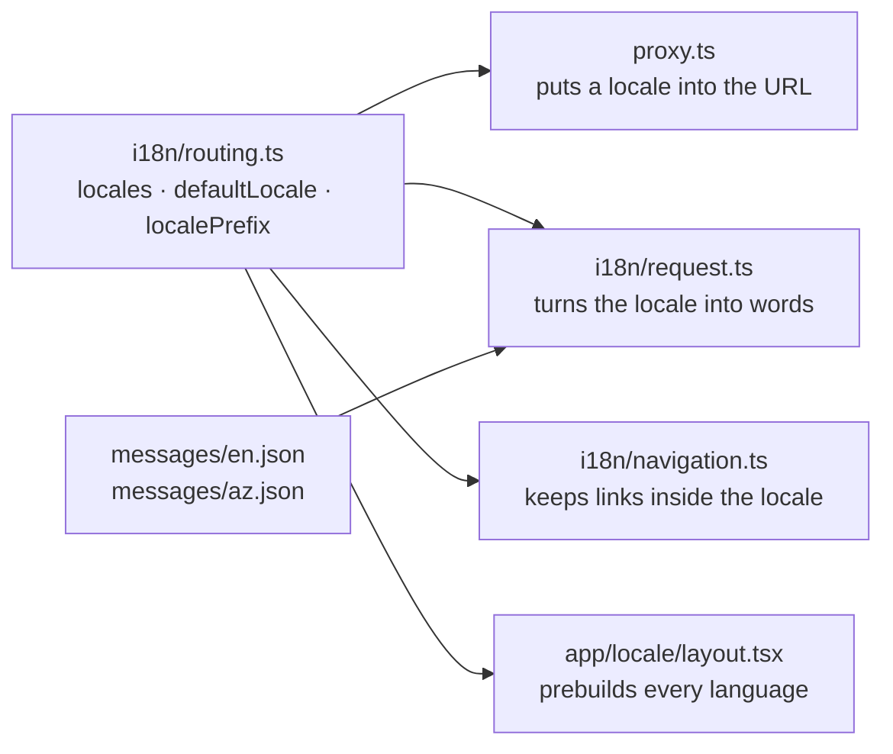
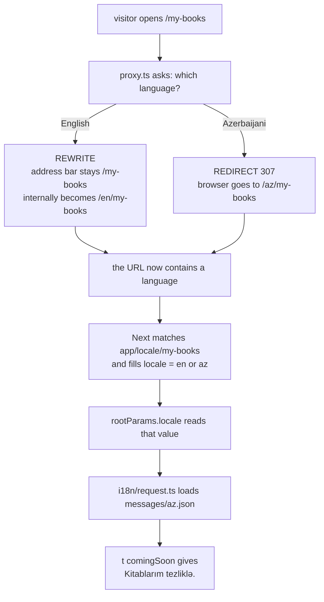
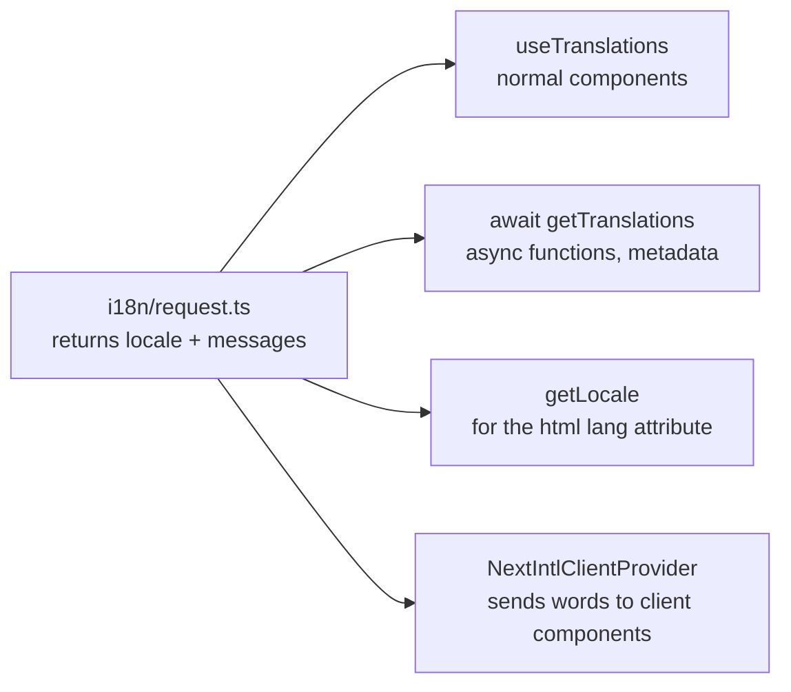
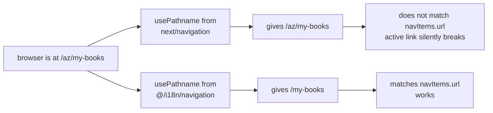

# How next-intl works in KitabThrift

Notes in plain language. Setup: Next 16.3, next-intl 4.13, locales `en` + `az`, `localePrefix: "as-needed"`.

---

## The one-sentence version

The URL decides the language, and one small file turns that language into the actual words.

Everything else is plumbing to make those two things reliable.

---

## The five files

Only one file names your languages. The other four import it, so adding a language is a one-line change.



| File | Its one job |
|---|---|
| `i18n/routing.ts` | Declares `en`, `az`, the default, and the URL style |
| `proxy.ts` | Makes sure every URL has a language in it |
| `i18n/request.ts` | Reads that language, loads the matching JSON |
| `i18n/navigation.ts` | Locale-aware `Link`, `usePathname`, `useRouter` |
| `messages/*.json` | The actual words, grouped by namespace |

---

## What happens on one request

The confusing part: for English the language **is** in the URL — just not the one you see in the address bar.



### Rewrite vs redirect

This is the single idea worth remembering.

| | Rewrite (English) | Redirect (Azerbaijani) |
|---|---|---|
| Requests | 1 | 2 |
| Address bar | unchanged | changes |
| Who does the work | the server, silently | the browser, visibly |
| Result | two different URLs | both URLs the same |

**Rewrite** = "serve a different page than the URL says, quietly."
**Redirect** = "throw this request away, tell the browser to go somewhere else."

### Real behavior, measured

| Request | Result |
|---|---|
| `/` | 200, rewritten to `/en` |
| `/my-books` | 200, rewritten to `/en/my-books` |
| `/az` | 200, no rewrite needed |
| `/en` | 307 → `/` |
| `/en/my-books` | 307 → `/my-books` |
| `/favicon.ico` | never reaches the proxy |

Note the last redirects: `as-needed` doesn't just *allow* the bare URL for English, it *removes* a redundant `/en` if you type it. Each page ends up with exactly one correct URL per language.

---

## How the proxy picks a language

When the URL has no language in it, four things are checked **in order**. First match wins.

1. **Language in the URL** — `/az/my-books` → always wins
2. **`NEXT_LOCALE` cookie** — the visitor's saved choice
3. **`Accept-Language` header** — their browser's preference
4. **`defaultLocale`** — `"en"`, last resort

The proxy also *writes* that cookie on every response, which is how a manual language switch survives the next visit.

### The matcher

```ts
matcher: ["/((?!api|_next|_vercel|.*\\..*).*)"]
```

Read as "run on everything **except**":

- paths starting with `api`, `_next`, `_vercel`
- `.*\..*` = anything **containing a dot** → i.e. files like `logo.png`, `favicon.ico`

Why: negotiating a language for an image is pointless, and rewriting `/favicon.ico` to `/en/favicon.ico` would break it.

---

## Root params: the folder name is the contract

The folder is called `[locale]`, so Next generates a function called `locale()`.

```
app/[locale]/  →  rootParams.locale()
app/[lang]/    →  rootParams.lang()
```

It's `await`ed because the value only exists during a real request — same as `cookies()` or `headers()`.

**Only the outermost dynamic folder is a root param.** If you later add `app/[locale]/books/[id]/`, then `id` is a normal param read from `params` — not from `next/root-params`.

### One folder, many pages

You write one file. The build makes one page per language.

```
SOURCE                          BUILD OUTPUT
app/[locale]/page.tsx      →    en.html   az.html
app/[locale]/my-books/     →    en/my-books.html   az/my-books.html
```

`generateStaticParams` in the layout is what decides the list — it returns `routing.locales`.

---

## request.ts, line by line

```ts
export default getRequestConfig(async ({ locale }) => {
  if (!locale) {                                    // 1
    const paramValue = await rootParams.locale();   // 2
    if (!hasLocale(routing.locales, paramValue))    // 3
      notFound();
    locale = paramValue;
  }
  return {
    locale,
    messages: (await import(`../messages/${locale}.json`)).default   // 4
  };
});
```

1. `locale` is an **override**, only set if someone writes `getTranslations({locale: "az"})`. Normally `undefined`.
2. Read the language out of the URL segment.
3. Is it really one of ours? If not, `notFound()` — which **throws**, it doesn't return. Nothing after it runs.
4. `.default` unwraps the module. `await import()` gives you `{ default: {...} }`, not the JSON itself — without `.default` every lookup fails.

### Nothing imports this file

It's wired by the plugin in `next.config.ts`, which aliases `next-intl/config` to your file. next-intl's internals import that alias.

---

## Who uses the result



These are **siblings**, not a chain. The layout doesn't pass the language down to the pages — everyone reads the same cached config independently. Delete `getLocale()` from the layout and translations still work; you'd only lose the `lang` attribute.

### useTranslations vs getTranslations

Same translator, different call style.

| | Where |
|---|---|
| `useTranslations()` | normal components — server **and** client |
| `await getTranslations()` | async functions, `generateMetadata`, route handlers |

Rule: **`useTranslations` cannot be used in an `async` component.** Prefer it anyway — a component written with it can gain `"use client"` later without any change.

---

## Words: namespace, then key

```json
// messages/az.json
{
  "MyBooksPage": {              // ← namespace
    "comingSoon": "Kitablarım tezliklə."   // ← key
  }
}
```

```tsx
const t = useTranslations("MyBooksPage");   // namespace
t("comingSoon");                            // key
```

---

## Why navigation.ts exists

`createNavigation(routing)` hands back versions of `Link` and `usePathname` that know about your languages.



Two benefits:

**You write one href for every language.** `<Link href="/my-books">` becomes `/az/my-books` automatically. No building `/${locale}/...` strings by hand.

**`usePathname` strips the language back off.** This is the one that matters. `lib/constants.ts` stores language-free URLs like `/my-books`, and `nav-links.tsx` compares against them. The plain Next hook would return `/az/my-books`, the comparison would fail, and active styling would break on every non-default language — with no error.

Use the wrapper for anything path-related: `Link`, `redirect`, `permanentRedirect`, `usePathname`, `useRouter`, `getPathname`.
Keep using Next for the rest: `notFound`, `useSearchParams`, `useParams`.

---

## Recipe: add a language

1. Add the code to `locales` in `i18n/routing.ts`:
   ```ts
   locales: ["en", "az", "tr"],
   ```
2. Copy `messages/en.json` to `messages/tr.json` and translate the values. Keep the keys identical.

That's it. These update themselves:

- `generateStaticParams` prebuilds `/tr` and `/tr/my-books`
- the proxy starts negotiating `tr`
- `Link` starts emitting `/tr/...`
- `hreflang` alternates gain a `tr` entry

---

## Recipe: add a page

Say `/wishlist`.

1. Create `app/[locale]/wishlist/page.tsx` — **inside** the locale folder:
   ```tsx
   import { useTranslations } from "next-intl";

   export default function WishlistPage() {
     const t = useTranslations("WishlistPage");
     return <p>{t("empty")}</p>;
   }
   ```
   No `params`, no `async`.

2. Add the namespace to **every** messages file, not just English:
   ```json
   "WishlistPage": { "empty": "Nothing saved yet." }
   ```

3. Only if it goes in the nav — add to `navItems` in `lib/constants.ts` with a language-free URL and a `key`:
   ```ts
   { id: 3, url: "/wishlist", key: "wishlist", icon: Heart }
   ```
   Then add `"wishlist"` under the `Nav` namespace in every messages file.

If the page needs to `await` data, it becomes `async` — then switch to `await getTranslations("WishlistPage")`.

---

## Six ways to break it

| Mistake | What happens |
|---|---|
| Importing `Link` / `usePathname` from `next/navigation` | **Silent.** Links lose the prefix, active styling dies on non-default languages |
| `useTranslations` in an `async` component | Throws: *"useTranslations is not callable within an async component"* |
| Adding a key to only one messages file | English works, Azerbaijani throws a missing-message error |
| Hardcoding `href="/az/my-books"` | Traps the visitor in one language |
| Adding a locale without creating its JSON | Build fails on the dynamic import |
| Page outside `app/[locale]/` | No root param exists, so the language can't be resolved at all |

---

## Glossary

**Proxy / middleware** — code that runs before routing, on every matching request. In Next 16 the file is `proxy.ts` (it used to be `middleware.ts`).

**Rewrite** — serve a different internal URL without changing the address bar.

**Redirect** — tell the browser to request a different URL. Visible, and costs a second request.

**Root param** — the outermost `[folder]` value, readable anywhere via `next/root-params` without passing props.

**Namespace** — the top-level grouping in a messages file: `Nav`, `Metadata`, `MyBooksPage`.

**`as-needed`** — the default language has no prefix in the URL; every other language always does.
